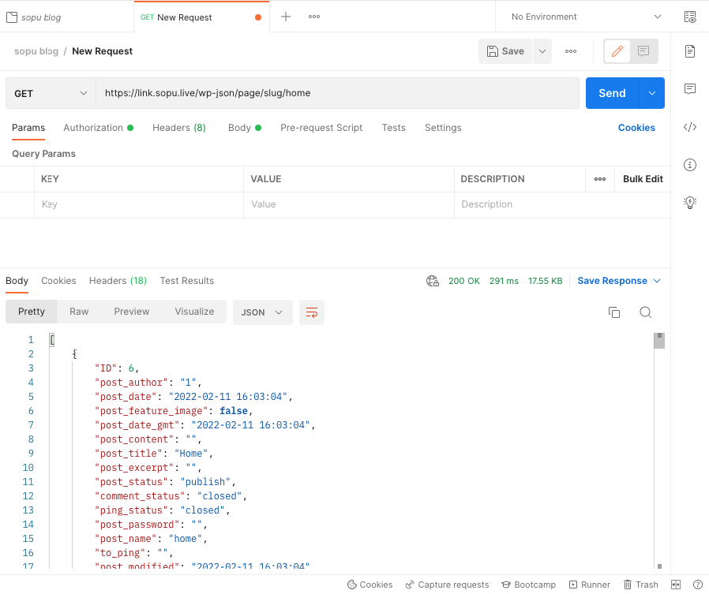

# Create Custom Rest API Endpoint in Wordpress

### Check this [api](https://link.sopu.live/wp-json/page/slug/home)
https://link.sopu.live/wp-json/page/slug/home


####Init rest api using [action hook](https://developer.wordpress.org/reference/functions/add_action/) first and use [register_route](https://developer.wordpress.org/reference/functions/register_rest_route/) function for register custom endpoint for rest api. Write all the code in function.php file
```
add_action('rest_api_init', function () {

//    register route
    register_rest_route('page', 'slug/(?P<slug>[-\w]{1,255})', array(
        'method' => 'GET',
        'callback' => 'GET_ALL_PAGE_BY_SLUG',
        'args' => array(
            'id' => array(
                //call back function
                'validate_callback' => function ($param, $request, $key) {
                    return is_numeric($param);
                }
            ),
        ),
        'permission_callback' => function () {
            return true;
        }
    ));

});
```

So we are register this page/slug/('page slug') route. Now declare the callback function with your functionalities.
```
function GET_ALL_PAGE_BY_SLUG($request)
{
    $args = array(
        'name' => $request->params['slug'],
        'post_type' => 'page',
        'post_status' => 'publish',
        'numberposts' => 1
    );


    $myposts = get_posts($args);


    foreach ($myposts as $single) : setup_postdata($single);


        $meta = get_post_meta($single->ID);

        $src = wp_get_attachment_url(get_post_thumbnail_id($single->ID), 'full', true);


        $array = array(
            'ID' => $single->ID,
            'post_author' => $single->post_author,
            'post_date' => $single->post_date,
            'post_feature_image' => $src,
            'post_date_gmt' => $single->post_date_gmt,
            'post_content' => $single->post_content,
            'post_title' => $single->post_title,
            'post_excerpt' => $single->post_excerpt,
            'post_status' => $single->post_status,
            'comment_status' => $single->comment_status,
            'ping_status' => $single->ping_status,
            'post_password' => $single->post_password,
            'post_name' => $single->post_name,
            'to_ping' => $single->to_ping,
            'post_modified' => $single->post_modified,
            'post_modified_gmt' => $single->post_modified_gmt,
            'post_content_filtered' => $single->post_content_filtered,
            'post_parent' => $single->post_parent,
            'guid' => $single->guid,
            'menu_order' => $single->menu_order,
            'post_type' => $single->post_type,
            'post_mime_type' => $single->post_mime_type,
            'comment_count' => $single->comment_count,
            'filter' => $single->filter,
        );


        // return $array;
        $op[] = $array;

        wp_reset_postdata(); endforeach;


    header('Content-type: application/json');
    echo json_encode($op, JSON_PRETTY_PRINT);


}
```

Now go to the postman and hit the api.my page slug is 'home', Hit the api is https://link.sopu.live/wp-json/page/slug/home

